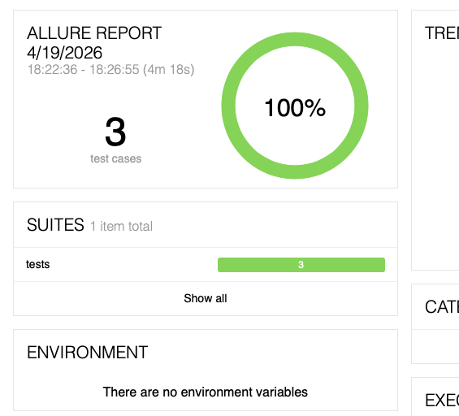

# UI Autotests. Practice Automation Form Fields

Проект UI-автотестов на Python + Selenium WebDriver + PyTest + Allure.
Тестирование функциональности сайта https://automationteststore.com/.

## Стек

- Python 3.10+
- Selenium WebDriver 4 (Chrome)
- PyTest 8
- PyTest-xdist 3.5
- Allure-pytest
- webdriver-manager

## Структура проекта

```
SDET_UI_AUTOTESTS/
├── conftest.py          
├── pytest.ini           
├── requirements.txt     
├── config/constants.py
├── .gitignore
├── README.md
├── pages/
│   ├── base_page.py
│   ├── home_page.py
│   ├── category_page.py
│   ├── product_page.py
│   ├── search_results_page.py
│   └── cart_page.py
└── tests/
    ├── test_skincare_sorting.py
    ├── test_search_shirt_sorting.py
    └── test_cart_random_products.py

```

## Паттерны проектирования

| Паттерн | Реализация |
|---|---|
| **Page Object Model** | `FormPage` содержит только методы взаимодействия; тесты — в `tests/` |
| **Page Factory** | Локаторы реализованы как `@property` в `FormPage` — элемент ищется в DOM в момент обращения |
| **Fluent Interface** | Каждый action-метод возвращает `self`, что позволяет строить цепочки вызовов в тесте |

## Установка и запуск. macOS

```bash
python -m venv venv
source venv/bin/activate       
pip install -r requirements.txt
pytest -v -s
allure serve allure-results
```

## Allure Report


## Тест-кейсы

### TC-01. Фильтрация в категориях.

**Предусловие:** браузер открыт, открыта главная страница https://automationteststore.com/

|  | Шаг | Ожидаемый результат |
|---|---|---|
| 1 | Выбрать любой раздел и категорию товаров в нем, убедиться, что в категории не менее 4 товаров | В выбранной рандомно категории содержится не менее 4 товаров |
| 2 | В выпадающем списке сортировки выбрать **Name A-Z** | Происходит сортировка по алфавиту |
| 3 | В выпадающем списке сортировки выбрать **Name Z-А** | Происходит сортировка по алфавиту по убыванию|
| 4 | В выпадающем списке сортировки выбрать **High > Low**| Происходит сортировка по возрастанию цены |
| 5 | В выпадающем списке сортировки выбрать **Low > High** | Происходит сортировка по убыванию цены |

**Ожидаемый результат:** Выбирается категория товаров, в которой не менее 4 наименований. Товары сортируются по имени и цене в обе стороны.

### TC-03. Проверка корзины
**Предусловие:** браузер открыт, открыта главная страница https://automationteststore.com/

|  | Шаг | Ожидаемый результат |
|---|---|---|
| 1 | Заполнить поле для поиска значением `shirt` и нажать **Поиск** | Выводятся товары, имеющие в описании слово `shirt` |
| 2 | В выпадающем списке сортировки выбрать **Name A-Z** | Происходит сортировка по алфавиту |
| 3 | Добавить в корзину второй товар из выдачи | Открывается страница с подробным описанием товара|
| 4 | Указать любое количество (от 1 до 10)| Товар в нужном количестве появляется в корзине |
| 5 | Добавить в корзину третий товар из выдачи | Открывается страница с подробным описанием товара |
| 6 | Указать любое количество (от 1 до 10) | Товар в нужном количестве появляется в корзине |
| 7 | Выбрать самый дешевый товар из двух в корзине и увеличить его количество вдвое | Количество и итоговая стоимость отображаются верно |

**Ожидаемый результат:** Второй и третий товары из выдачи по слову `shirt` находятся в корзине. Первоначальное количество самого дешевого товара увеличено в два раза, итоговая стоимость товаров в корзине пересчитана.

---

### TC-03. Проверка корзины

**Предусловие:** браузер открыт, открыта главная страница https://automationteststore.com/

|  | Шаг | Ожидаемый результат |
|---|---|---|
| 1 | Выбрать товар на главной странице | Раскрывается страница с описанием товара |
| 2 | Указать количество (от 1 до 10) и нажать кнопку добавления в корзиу | Товар оказывается в корзине, меняется счетчик индикатора |
| 3 | Добавить таким же образом еще 4 любых товара с главной страницы, открыть корзину | В корзине 5 выбранных товаров, сумма отображается верно |
| 4 | Удалить из корзины 2 и 4 товары | Товары убраны, итоговая сумма поменялась |

**Ожидаемый результат:** в корзине 3 товара